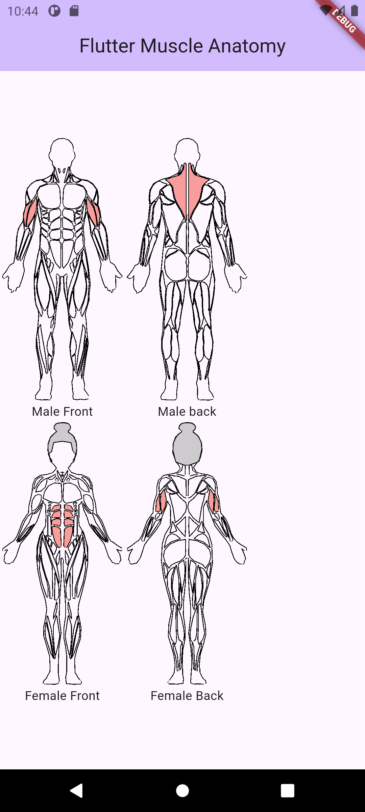
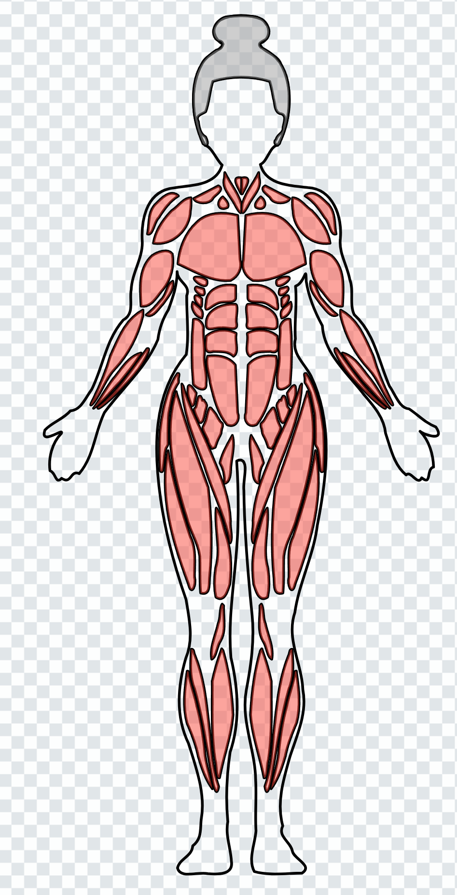
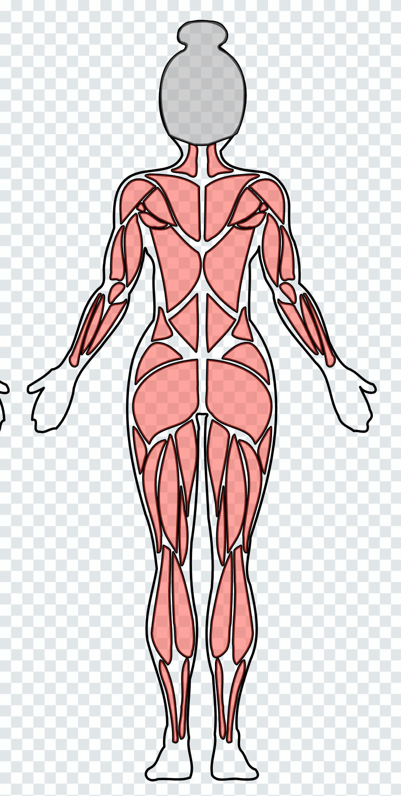
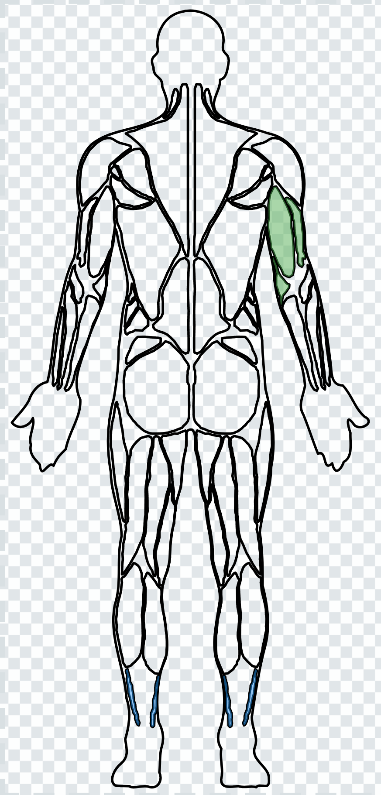
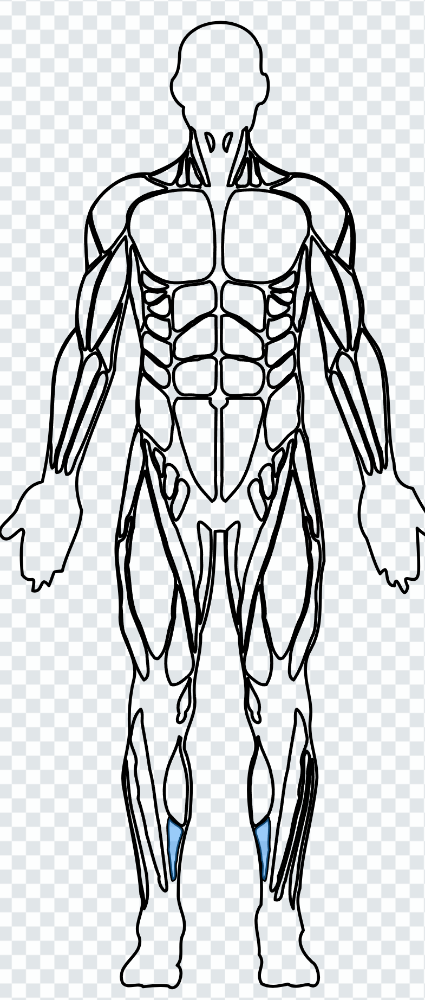

<!--
This README describes the package. If you publish this package to pub.dev,
this README's contents appear on the landing page for your package.

For information about how to write a good package README, see the guide for
[writing package pages](https://dart.dev/tools/pub/writing-package-pages).

For general information about developing packages, see the Dart guide for
[creating packages](https://dart.dev/guides/libraries/create-packages)
and the Flutter guide for
[developing packages and plugins](https://flutter.dev/to/develop-packages).
-->

# flutter_muscle_anatomy

[](https://pub.dartlang.org/packages/flutter_muscle_anatomy)







<!--


-->

A flutter library for showing muscle anatomy.

## Features

Use this library in your flutter app to:

* Show the muscle anatomy of the body.
* Highlight certain muscles.
* Create silhouette or outline of the body
* Show the Front and Back views of body muscles
* Show either male or female muscle anatomy

## Getting started

Add the package to your `pubspec.yaml`:

```yaml
dependencies:
  flutter_muscle_anatomy: ^1.0.0
  flutter_svg: ^2.0.0 # Recommended for rendering SVG strings
```

## Usage

### 1. Simple Views (Male & Female)

You can easily display the front or back view of a male or female body.

```dart
// Male Front View
final maleFront = Male.front();

// Female Back View with custom hair color
final femaleBack = Female.back(hairColor: Colors.brown);

// Render using SvgPicture
SvgPicture.string(maleFront.toString());
```

### 2. Multi-View Displays

Display both front and back views simultaneously. The library handles the layout and alignment.

```dart
// Front then Back
final maleBoth = Male.frontBack();

// Back then Front
final femaleBoth = Female.backFront();

// Shortcut for frontBack
final anatomy = Male.both();
```

### 3. Smart View (By Muscles)

If you only want to show the views that contain specific muscles, use `byMuscles`. It automatically decides whether to show the front, back, or both based on the muscles provided.

```dart
final anatomy = Male.byMuscles([
  Muscle.biceps,
  Muscle.trapezius,
]);
// This will likely show both views since biceps are front and trapezius is back.
```

### 4. Highlighting Muscles

Highlight specific muscles with custom colors and opacity.

```dart
final anatomy = Male.front();

// Highlight a single muscle (Specific side)
anatomy.highlight(
  Muscle.biceps,
  position: MusclePosition.right,
  color: Colors.green,
  opacity: 0.7,
);

// Highlight multiple muscles (Both sides by default)
anatomy.highlights(
  [Muscle.abs, Muscle.quadriceps],
  color: Colors.red,
);
```

### 5. Dynamic Gender Selection

Use `BodyAnatomy` for scenarios where the gender is determined at runtime.

```dart
final gender = 'female'; // or 'm', 'male', 'f'
final factory = BodyAnatomy(gender);

final anatomy = factory.front();
// anatomy will be an instance of Female
```

### 6. Path Drawing (Canvas)

For high-performance custom rendering or animations, use the raw `Path` objects.

```dart
class MyCustomPainter extends CustomPainter {
  @override
  void paint(Canvas canvas, Size size) {
    final anatomy = Male.front();
    final muscles = anatomy.getAllMusclePaths();
    final outline = anatomy.outlinePaths.first;

    // ... scaling and transformation logic ...

    final paint = Paint()
      ..style = PaintingStyle.stroke
      ..color = Colors.black;

    for (final path in muscles) {
      canvas.drawPath(path, paint);
    }
    canvas.drawPath(outline, paint..strokeWidth = 2);
  }

  @override
  bool shouldRepaint(covariant CustomPainter oldDelegate) => false;
}
```

## Contributing

Contributions are always welcome.

Check out the *source-\*.svg* files under assets that were designed using Inkspace.

Ensure you export as plain SVG to *female_\*.svg* and *male_\*.svg* files accordingly.

Left and right muscles added should have *left_* and *right_* prefixes respectively, and the muscle
should be added to the Muscle enum.

Grouping muscles might not provide desired output, as group attributes such as *transform* are not
handled currently.

## Additional information

Give us a like.
